# 🗓️ Cybersecurity Learning Timeline

```mermaid
gantt
    title Adrian's Cybersecurity Roadmap (2025 - 2026)
    dateFormat  YYYY-MM-DD
    section Foundations
    CS50x Weeks 0–7           :a1, 2025-07-22, 30d
    Linux + CLI Basics        :a2, 2025-07-25, 20d
    Python Scripting Basics   :a3, 2025-08-20, 20d
    Networking Fundamentals   :a4, 2025-09-10, 20d

    section Cybersecurity & Labs
    Google Cyber Cert         :b1, 2025-10-01, 30d
    TryHackMe Beginner Path   :b2, 2025-10-15, 25d
    PortSwigger Web Labs      :b3, 2025-11-15, 20d
    Python for Security       :b4, 2025-12-01, 15d

    section Capstone + Planning
    Jr PenTester + Projects   :c1, 2025-12-20, 25d
    CISSP Planning + Reading  :c2, 2026-01-20, 45d
```

> ⚠️ You can preview this timeline using [Mermaid Live Editor](https://mermaid.live/edit) or in GitHub by pasting it into a markdown file and enabling diagram preview via browser extensions like *Markdown Preview Enhanced*.

